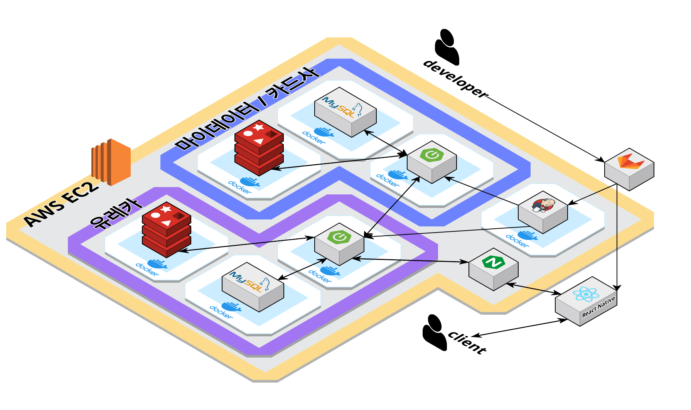

#  Eureka

<b>마이데이터를 활용한 카드 추천 서비스</b>

<br />


## 🕞 프로젝트 기간
**2024.02.26 ~ 2024.04.05** (6주)

<br />


## 💬 프로젝트 개요

- QR 코드 간편 결제

- 할인 및 실적을 고려하여 결제 시 최적의 카드 추천

- 소비 통계를 기반으로 카드 상품 추천

<br />


## 💻 서비스 화면


| 1. 메인화면 | 2. 보유카드 등록 | 3. 결제카드 등록 |
|:-----:|:-----:|:-----:|
|  |  |  |

<br />

<br />

<br />

| 4. 간편 결제 | 5. 결제 내역 |
|:-----:|:-----:|
|  |  |

<br />

<br />

<br />

| 6. 또래 소비 비교 | 7. 통계 페이지 |
|:-----:|:-----:|
|  |  |

<br />

<br />

<br />

| 8. 카드 상품 추천 | 9. 카드 혜택 비교 |
|:-----:|:-----:|
|  |  |

<br />

<br />

<br />

| 10. 카드사별 카드 조회 | 11. 카테고리별 카드 조회 |
|:-----:|:-----:|
|  |  |

<br />


## 👩‍💻 개발 환경

||일정관리|형상관리|코드리뷰|커뮤니케이션|디자인|UCC|
|:---:|:---:|:---:|:---:|:---:|:---:|:---:|
| **TOOL** |  |  |  |  |  |  |

<br>

#### Frontend

 
 

 
 
 

<br>

#### Backend


 


 

 
<br>

#### DevOPS

   

<br />


## 🏢 아키텍처



<br />

## 📂 프로젝트 파일 구조

<details>
<summary>FrontEnd</summary>

```
📦src
 ┣ 📂apis
 ┃ ┣ 📜Api.jsx
 ┃ ┣ 📜CardAPi.jsx
 ┃ ┣ 📜HomeApi.jsx
 ┃ ┣ 📜ProductApi.jsx
 ┃ ┗ 📜StatisticsApi.jsx
 ┣ 📂pages
 ┃ ┣ 📂CardPage
 ┃ ┃ ┣ 📜BankListModal.jsx
 ┃ ┃ ┣ 📜CardDetailPage.jsx
 ┃ ┃ ┣ 📜CardDetailPayPage.jsx
 ┃ ┃ ┣ 📜CardHome.jsx
 ┃ ┃ ┣ 📜OwnCardEnrollPage.jsx
 ┃ ┃ ┣ 📜OwnCardPage.jsx
 ┃ ┃ ┣ 📜OwnCardPage2.jsx
 ┃ ┃ ┣ 📜PayCardEnrollPage.jsx
 ┃ ┃ ┗ 📜PayCardPage.jsx
 ┃ ┣ 📂HomePage
 ┃ ┃ ┣ 📂components
 ┃ ┃ ┃ ┣ 📜HomeForYou.jsx
 ┃ ┃ ┃ ┣ 📜HomeIcon.jsx
 ┃ ┃ ┃ ┣ 📜HomeMonthly.jsx
 ┃ ┃ ┃ ┣ 📜HomeOnlyPay.jsx
 ┃ ┃ ┃ ┗ 📜HomePayCard.jsx
 ┃ ┃ ┣ 📜Compare.jsx
 ┃ ┃ ┣ 📜HomePage.jsx
 ┃ ┃ ┗ 📜OnlyPay.jsx
 ┃ ┣ 📂LoadingPage
 ┃ ┃ ┣ 📜LoadingPage.jsx
 ┃ ┃ ┗ 📜SplashPage.jsx
 ┃ ┣ 📂ProductPage
 ┃ ┃ ┣ 📂components
 ┃ ┃ ┃ ┣ 📂ByCardComponent
 ┃ ┃ ┃ ┃ ┣ 📜CardList.jsx
 ┃ ┃ ┃ ┃ ┗ 📜ChooseOne.jsx
 ┃ ┃ ┃ ┣ 📂ByCategoryComponent
 ┃ ┃ ┃ ┃ ┣ 📜CategoryCardList.jsx
 ┃ ┃ ┃ ┃ ┗ 📜CategoryChooseOne.jsx
 ┃ ┃ ┃ ┣ 📜ByCard.jsx
 ┃ ┃ ┃ ┣ 📜ByCategory.jsx
 ┃ ┃ ┃ ┣ 📜CategoryRecommend.jsx
 ┃ ┃ ┃ ┣ 📜CompareCard.jsx
 ┃ ┃ ┃ ┣ 📜CurrentBenefit.jsx
 ┃ ┃ ┃ ┣ 📜CurrentBenefitMore.jsx
 ┃ ┃ ┃ ┣ 📜FitYourConsumption.jsx
 ┃ ┃ ┃ ┣ 📜IfUseRecommendCard.jsx
 ┃ ┃ ┃ ┣ 📜IfWantKnowOtherCard.jsx
 ┃ ┃ ┃ ┣ 📜MainNotice.jsx
 ┃ ┃ ┃ ┣ 📜NoPaymentCardErr.jsx
 ┃ ┃ ┃ ┣ 📜SelectCardInfo.jsx
 ┃ ┃ ┃ ┗ 📜TwoCategory.jsx
 ┃ ┃ ┗ 📜ProductPage.jsx
 ┃ ┣ 📂QRScanPage
 ┃ ┃ ┣ 📜PayCheck.jsx
 ┃ ┃ ┣ 📜PayComplete.jsx
 ┃ ┃ ┣ 📜PayLoadingPage.jsx
 ┃ ┃ ┗ 📜QRCodeScanner.jsx
 ┃ ┣ 📂SettingPage
 ┃ ┃ ┣ 📂components
 ┃ ┃ ┃ ┣ 📜ConfirmLoading.jsx
 ┃ ┃ ┃ ┣ 📜PasswordChange.jsx
 ┃ ┃ ┃ ┣ 📜PasswordChangeConfirm.jsx
 ┃ ┃ ┃ ┣ 📜PaymentPassword.jsx
 ┃ ┃ ┃ ┗ 📜VerifyPasswordChange.jsx
 ┃ ┃ ┗ 📜SettingPage.jsx
 ┃ ┣ 📂SignUpPage
 ┃ ┃ ┣ 📂components
 ┃ ┃ ┃ ┣ 📜SignupPasswordChange.jsx
 ┃ ┃ ┃ ┗ 📜SignupPasswordChangeConfirm.jsx
 ┃ ┃ ┣ 📜PasswordConfirmPage.jsx
 ┃ ┃ ┣ 📜PasswordPage.jsx
 ┃ ┃ ┗ 📜SignupPage.jsx
 ┃ ┗ 📂StatisticsPage
 ┃ ┃ ┣ 📂components
 ┃ ┃ ┃ ┣ 📂BenefitGraphComponents
 ┃ ┃ ┃ ┃ ┗ 📜BenefitCategoryList.jsx
 ┃ ┃ ┃ ┣ 📂CardRankingComponents
 ┃ ┃ ┃ ┃ ┗ 📜CardRakingList.jsx
 ┃ ┃ ┃ ┣ 📂ConsumptionOfYouComponents
 ┃ ┃ ┃ ┃ ┗ 📜ConsumptionCategoryList.jsx
 ┃ ┃ ┃ ┣ 📜AkaOfYou.jsx
 ┃ ┃ ┃ ┣ 📜BenefitAmountOfYou.jsx
 ┃ ┃ ┃ ┣ 📜BenefitGraph.jsx
 ┃ ┃ ┃ ┣ 📜CardRanking.jsx
 ┃ ┃ ┃ ┣ 📜ConsumptionOfYou.jsx
 ┃ ┃ ┃ ┗ 📜MyAkaList.jsx
 ┃ ┃ ┗ 📜StatisticsPage.jsx
 ┣ 📂routers
 ┃ ┣ 📜AuthRouters.jsx
 ┃ ┣ 📜CardRouters.jsx
 ┃ ┣ 📜HomeRouters.jsx
 ┃ ┣ 📜ProductRouters.jsx
 ┃ ┣ 📜QRScanRouters.jsx
 ┃ ┣ 📜Routers.jsx
 ┃ ┗ 📜StatisticsRouters.jsx
 ┣ 📂slices
 ┃ ┣ 📜cardSlice.jsx
 ┃ ┣ 📜productSlice.jsx
 ┃ ┣ 📜staticSlice.jsx
 ┃ ┗ 📜userSlice.jsx
 ┗ 📂stores
   ┣ 📜SettingUtils.jsx
   ┣ 📜store.jsx
   ┗ 📜TokenUtils.jsx
```
</details>

<details>
<summary>BackEnd</summary>

```
📦eureka
 ┣ 📂batch
 ┃ ┣ 📂job
 ┃ ┃ ┣ 📜CardOwnershipJob.java
 ┃ ┃ ┗ 📜ConsumptionUserJob.java
 ┃ ┗ 📜BatchScheduler.java
 ┣ 📂common
 ┃ ┣ 📂exception
 ┃ ┃ ┣ 📜CustomException.java
 ┃ ┃ ┣ 📜ErrorResponse.java
 ┃ ┃ ┗ 📜GlobalExceptionHandler.java
 ┃ ┗ 📂response
 ┃ ┃ ┣ 📜MyDataApiResponse.java
 ┃ ┃ ┗ 📜ResponseCode.java
 ┣ 📂config
 ┃ ┣ 📜RedisConfig.java
 ┃ ┣ 📜S3Config.java
 ┃ ┣ 📜SecurityConfig.java
 ┃ ┣ 📜SwaggerConfig.java
 ┃ ┗ 📜WebConfig.java
 ┣ 📂domain
 ┃ ┣ 📂auth
 ┃ ┃ ┗ 📂jwt
 ┃ ┃ ┃ ┣ 📜CustomAccessDeniedHandler.java
 ┃ ┃ ┃ ┣ 📜CustomAuthenticationEntryPoint.java
 ┃ ┃ ┃ ┣ 📜CustomJwtAuthenticationFilter.java
 ┃ ┃ ┃ ┣ 📜CustomUserDetailsService.java
 ┃ ┃ ┃ ┣ 📜JwtService.java
 ┃ ┃ ┃ ┗ 📜JwtTokenProvider.java
 ┃ ┣ 📂card
 ┃ ┃ ┣ 📂controller
 ┃ ┃ ┃ ┣ 📜CardController.java
 ┃ ┃ ┃ ┗ 📜UserCardController.java
 ┃ ┃ ┣ 📂dto
 ┃ ┃ ┃ ┣ 📂request
 ┃ ┃ ┃ ┃ ┣ 📜RegistPayCardRequest.java
 ┃ ┃ ┃ ┃ ┣ 📜RegistUserCardRequest.java
 ┃ ┃ ┃ ┃ ┗ 📜SearchUserCardRequest.java
 ┃ ┃ ┃ ┣ 📂response
 ┃ ┃ ┃ ┃ ┣ 📜CardCompanyListResponse.java
 ┃ ┃ ┃ ┃ ┣ 📜CardCompareResponse.java
 ┃ ┃ ┃ ┃ ┣ 📜CardDetailBenefitList.java
 ┃ ┃ ┃ ┃ ┣ 📜CardHistoryListResponse.java
 ┃ ┃ ┃ ┃ ┣ 📜CardInfoResponse.java
 ┃ ┃ ┃ ┃ ┣ 📜CardProdDetailBenefitList.java
 ┃ ┃ ┃ ┃ ┣ 📜CardProdDetailResponse.java
 ┃ ┃ ┃ ┃ ┣ 📜CardProdListResponse.java
 ┃ ┃ ┃ ┃ ┣ 📜CardProdRecommendResponse.java
 ┃ ┃ ┃ ┃ ┣ 📜CardRecommendMainResponse.java
 ┃ ┃ ┃ ┃ ┣ 📜CardRecommendTop3.java
 ┃ ┃ ┃ ┃ ┣ 📜CardRecommendTop3List.java
 ┃ ┃ ┃ ┃ ┣ 📜MyDataCardListResponse.java
 ┃ ┃ ┃ ┃ ┣ 📜OwnUserCardResponse.java
 ┃ ┃ ┃ ┃ ┣ 📜PayUserCardResponse.java
 ┃ ┃ ┃ ┃ ┣ 📜Top3ListAndLargeCategoryNameResponse.java
 ┃ ┃ ┃ ┃ ┗ 📜UserCardListResponse.java
 ┃ ┃ ┃ ┣ 📜CardBenefitDetailEntity.java
 ┃ ┃ ┃ ┣ 📜CardBenefitEntity.java
 ┃ ┃ ┃ ┣ 📜CardCompanyEntity.java
 ┃ ┃ ┃ ┣ 📜CardEntity.java
 ┃ ┃ ┃ ┣ 📜CardProductDto.java
 ┃ ┃ ┃ ┗ 📜UserCardEntity.java
 ┃ ┃ ┣ 📂repository
 ┃ ┃ ┃ ┣ 📜CardBenefitDetailRepository.java
 ┃ ┃ ┃ ┣ 📜CardBenefitRepository.java
 ┃ ┃ ┃ ┣ 📜CardCompanyRepository.java
 ┃ ┃ ┃ ┣ 📜CardRepository.java
 ┃ ┃ ┃ ┣ 📜MydataTokenRepository.java
 ┃ ┃ ┃ ┗ 📜UserCardRepository.java
 ┃ ┃ ┣ 📂service
 ┃ ┃ ┃ ┣ 📜CardService.java
 ┃ ┃ ┃ ┣ 📜CardServiceImpl.java
 ┃ ┃ ┃ ┣ 📜UserCardService.java
 ┃ ┃ ┃ ┗ 📜UserCardServiceImpl.java
 ┃ ┃ ┗ 📂util
 ┃ ┃ ┃ ┣ 📜AsyncUserCardStaticsUtil.java
 ┃ ┃ ┃ ┗ 📜CardDataUtil.java
 ┃ ┣ 📂category
 ┃ ┃ ┣ 📂controller
 ┃ ┃ ┃ ┗ 📜CategoryController.java
 ┃ ┃ ┣ 📂dto
 ┃ ┃ ┃ ┣ 📂request
 ┃ ┃ ┃ ┣ 📂response
 ┃ ┃ ┃ ┃ ┗ 📜LargeCategoryListResponse.java
 ┃ ┃ ┃ ┣ 📜LargeCategoryEntity.java
 ┃ ┃ ┃ ┗ 📜SmallCategoryEntity.java
 ┃ ┃ ┣ 📂repository
 ┃ ┃ ┃ ┣ 📜LargeCategoryRepository.java
 ┃ ┃ ┃ ┗ 📜SmallCategoryRepository.java
 ┃ ┃ ┗ 📂service
 ┃ ┃ ┃ ┣ 📜CategoryService.java
 ┃ ┃ ┃ ┗ 📜CategoryServiceImpl.java
 ┃ ┣ 📂mydata
 ┃ ┃ ┣ 📂dto
 ┃ ┃ ┃ ┣ 📂request
 ┃ ┃ ┃ ┃ ┣ 📜MyDataCardHistoryRequest.java
 ┃ ┃ ┃ ┃ ┗ 📜MyDataTokenRequest.java
 ┃ ┃ ┃ ┣ 📂response
 ┃ ┃ ┃ ┃ ┣ 📜MyDataCardHistoryResponse.java
 ┃ ┃ ┃ ┃ ┣ 📜MyDataTokenResponse.java
 ┃ ┃ ┃ ┃ ┗ 📜MyDataUserCardResponse.java
 ┃ ┃ ┃ ┗ 📜MyDataToken.java
 ┃ ┃ ┗ 📂feign
 ┃ ┃ ┃ ┗ 📜MyDataFeign.java
 ┃ ┣ 📂pay
 ┃ ┃ ┣ 📂controller
 ┃ ┃ ┃ ┗ 📜PayController.java
 ┃ ┃ ┣ 📂dto
 ┃ ┃ ┃ ┣ 📂request
 ┃ ┃ ┃ ┃ ┣ 📜AprrovePayRequest.java
 ┃ ┃ ┃ ┃ ┗ 📜RequestPayRequest.java
 ┃ ┃ ┃ ┣ 📂response
 ┃ ┃ ┃ ┃ ┣ 📜AprrovePayResponse.java
 ┃ ┃ ┃ ┃ ┣ 📜CardRecommendResponse.java
 ┃ ┃ ┃ ┃ ┣ 📜PayHistoryListResponse.java
 ┃ ┃ ┃ ┃ ┣ 📜PayHistoryResponse.java
 ┃ ┃ ┃ ┃ ┗ 📜RequestPayResponse.java
 ┃ ┃ ┃ ┣ 📜PartnershipStoreEntity.java
 ┃ ┃ ┃ ┣ 📜PayHistoryEntity.java
 ┃ ┃ ┃ ┗ 📜PayInfo.java
 ┃ ┃ ┣ 📂repository
 ┃ ┃ ┃ ┣ 📜PartnershipStoreRepository.java
 ┃ ┃ ┃ ┣ 📜PayHistoryRepository.java
 ┃ ┃ ┃ ┗ 📜PayInfoRepository.java
 ┃ ┃ ┣ 📂service
 ┃ ┃ ┃ ┣ 📜PayService.java
 ┃ ┃ ┃ ┗ 📜PayServiceImpl.java
 ┃ ┃ ┗ 📂util
 ┃ ┃ ┃ ┗ 📜PayUtil.java
 ┃ ┣ 📂payment
 ┃ ┃ ┣ 📂dto
 ┃ ┃ ┃ ┣ 📂request
 ┃ ┃ ┃ ┃ ┣ 📜ApprovePayRequest.java
 ┃ ┃ ┃ ┃ ┗ 📜PayTokenRequest.java
 ┃ ┃ ┃ ┗ 📂response
 ┃ ┃ ┃ ┃ ┣ 📜PayResponse.java
 ┃ ┃ ┃ ┃ ┗ 📜PayTokenResponse.java
 ┃ ┃ ┗ 📂feign
 ┃ ┃ ┃ ┗ 📜PaymentFeign.java
 ┃ ┣ 📂statistics
 ┃ ┃ ┣ 📂controller
 ┃ ┃ ┃ ┗ 📜StatisticsController.java
 ┃ ┃ ┣ 📂dto
 ┃ ┃ ┃ ┣ 📂response
 ┃ ┃ ┃ ┃ ┣ 📜BestCardStatisticsResponse.java
 ┃ ┃ ┃ ┃ ┣ 📜CardOwnershipResponse.java
 ┃ ┃ ┃ ┃ ┣ 📜ConsumptionCompareResponse.java
 ┃ ┃ ┃ ┃ ┣ 📜ConsumptionStatisticsResponse.java
 ┃ ┃ ┃ ┃ ┗ 📜DiscountStatisticsResponse.java
 ┃ ┃ ┃ ┣ 📜BestCardStatistics.java
 ┃ ┃ ┃ ┣ 📜CardOwnershipDto.java
 ┃ ┃ ┃ ┣ 📜CardOwnershipKey.java
 ┃ ┃ ┃ ┣ 📜ConsumptionCompareDto.java
 ┃ ┃ ┃ ┣ 📜ConsumptionStatistics.java
 ┃ ┃ ┃ ┣ 📜ConsumptionUserStaticKey.java
 ┃ ┃ ┃ ┣ 📜DiscountStatistics.java
 ┃ ┃ ┃ ┗ 📜TotalStatistics.java
 ┃ ┃ ┣ 📂entity
 ┃ ┃ ┃ ┣ 📜CardOwnershipOverviewEntity.java
 ┃ ┃ ┃ ┣ 📜CardOwnershipStaticEntity.java
 ┃ ┃ ┃ ┣ 📜ConsumptionLargeStaticEntity.java
 ┃ ┃ ┃ ┣ 📜ConsumptionSmallStaticEntity.java
 ┃ ┃ ┃ ┣ 📜ConsumptionStaticEntity.java
 ┃ ┃ ┃ ┣ 📜ConsumptionUserStaticEntity.java
 ┃ ┃ ┃ ┣ 📜DiscountLargeStaticEntity.java
 ┃ ┃ ┃ ┣ 📜DiscountSmallStaticEntity.java
 ┃ ┃ ┃ ┗ 📜DiscountStaticEntity.java
 ┃ ┃ ┣ 📂repository
 ┃ ┃ ┃ ┣ 📜CardOwnershipOverviewRepository.java
 ┃ ┃ ┃ ┣ 📜CardOwnershipStaticRepository.java
 ┃ ┃ ┃ ┣ 📜ConsumptionLargeStaticRepository.java
 ┃ ┃ ┃ ┣ 📜ConsumptionSmallStaticRepository.java
 ┃ ┃ ┃ ┣ 📜ConsumptionStaticRepository.java
 ┃ ┃ ┃ ┣ 📜ConsumptionUserStaticRepository.java
 ┃ ┃ ┃ ┣ 📜DiscountLargeStaticRepository.java
 ┃ ┃ ┃ ┣ 📜DiscountSmallStaticRepository.java
 ┃ ┃ ┃ ┗ 📜DiscountStaticRepository.java
 ┃ ┃ ┗ 📂service
 ┃ ┃ ┃ ┣ 📜StatisticService.java
 ┃ ┃ ┃ ┗ 📜StatisticServiceImpl.java
 ┃ ┣ 📂tag
 ┃ ┃ ┣ 📂controller
 ┃ ┃ ┃ ┗ 📜TagController.java
 ┃ ┃ ┣ 📂dto
 ┃ ┃ ┃ ┣ 📂request
 ┃ ┃ ┃ ┣ 📂response
 ┃ ┃ ┃ ┃ ┗ 📜TagListResponse.java
 ┃ ┃ ┃ ┣ 📜TagEntity.java
 ┃ ┃ ┃ ┗ 📜UserTagEntity.java
 ┃ ┃ ┣ 📂repository
 ┃ ┃ ┃ ┣ 📜TagRepository.java
 ┃ ┃ ┃ ┗ 📜UserTagRepository.java
 ┃ ┃ ┗ 📂service
 ┃ ┃ ┃ ┣ 📜TagService.java
 ┃ ┃ ┃ ┗ 📜TagServiceImpl.java
 ┃ ┗ 📂user
 ┃ ┃ ┣ 📂controller
 ┃ ┃ ┃ ┣ 📜AuthController.java
 ┃ ┃ ┃ ┗ 📜UserController.java
 ┃ ┃ ┣ 📂dto
 ┃ ┃ ┃ ┣ 📂request
 ┃ ┃ ┃ ┃ ┣ 📜CheckUserRequest.java
 ┃ ┃ ┃ ┃ ┣ 📜LoginRequest.java
 ┃ ┃ ┃ ┃ ┣ 📜PasswordRequest.java
 ┃ ┃ ┃ ┃ ┣ 📜SendMessageRequest.java
 ┃ ┃ ┃ ┃ ┗ 📜SignUpRequest.java
 ┃ ┃ ┃ ┣ 📂response
 ┃ ┃ ┃ ┃ ┣ 📜CheckUserRespnose.java
 ┃ ┃ ┃ ┃ ┣ 📜JwtTokenResponse.java
 ┃ ┃ ┃ ┃ ┗ 📜UserDataTokenResponse.java
 ┃ ┃ ┃ ┣ 📜RefreshToken.java
 ┃ ┃ ┃ ┣ 📜UserEntity.java
 ┃ ┃ ┃ ┗ 📜UserInfoDto.java
 ┃ ┃ ┣ 📂repository
 ┃ ┃ ┃ ┣ 📜RefreshTokenRepository.java
 ┃ ┃ ┃ ┗ 📜UserRepository.java
 ┃ ┃ ┗ 📂service
 ┃ ┃ ┃ ┣ 📜UserService.java
 ┃ ┃ ┃ ┗ 📜UserServiceImpl.java
 ┣ 📂util
 ┃ ┣ 📜AesUtil.java
 ┃ ┣ 📜DateParserUtil.java
 ┃ ┗ 📜UserUtil.java
 ┗ 📜BackendApplication.java
```
</details>

<details>
<summary>FE - Store</summary>

```
📦src
 ┣ 📂assets
 ┃ ┗ 📜react.svg
 ┣ 📂components
 ┃ ┗ 📜PayQRCode.jsx
 ┣ 📂pages
 ┃ ┣ 📜MainPage.jsx
 ┃ ┣ 📜PayPage.jsx
 ┃ ┗ 📜Root.jsx
 ┣ 📜App.jsx
 ┣ 📜index.css
 ┗ 📜main.jsx
```
</details>

<details>
<summary>BE - MyData & Card</summary>

```
📦card
 ┣ 📂Auth
 ┃ ┣ 📂controller
 ┃ ┃ ┣ 📜AuthController.java
 ┃ ┃ ┗ 📜RedisController.java
 ┃ ┣ 📂dto
 ┃ ┃ ┣ 📂request
 ┃ ┃ ┃ ┣ 📜CustomUserDetails.java
 ┃ ┃ ┃ ┣ 📜JoinDto.java
 ┃ ┃ ┃ ┣ 📜MyDataRequestDto.java
 ┃ ┃ ┃ ┗ 📜PayRequestDto.java
 ┃ ┃ ┣ 📂response
 ┃ ┃ ┃ ┣ 📜JwtTokenResponseDto.java
 ┃ ┃ ┃ ┗ 📜PayTokenResponse.java
 ┃ ┃ ┗ 📜RefreshToken.java
 ┃ ┣ 📂repository
 ┃ ┃ ┗ 📜RefreshTokenRepository.java
 ┃ ┗ 📂service
 ┃ ┃ ┣ 📂implementation
 ┃ ┃ ┃ ┗ 📜AuthServiceImpl.java
 ┃ ┃ ┗ 📜AuthService.java
 ┣ 📂Card
 ┃ ┣ 📂controller
 ┃ ┃ ┣ 📜CardController.java
 ┃ ┃ ┗ 📜HistoryController.java
 ┃ ┣ 📂dto
 ┃ ┃ ┣ 📂request
 ┃ ┃ ┃ ┗ 📜ApprovePayRequest.java
 ┃ ┃ ┗ 📂response
 ┃ ┃ ┃ ┣ 📜ApprovePayResponse.java
 ┃ ┃ ┃ ┗ 📜CardHistoryResponse.java
 ┃ ┣ 📂entity
 ┃ ┃ ┣ 📂repository
 ┃ ┃ ┃ ┗ 📜CardHistoryRepository.java
 ┃ ┃ ┣ 📜CardCompanyEntity.java
 ┃ ┃ ┣ 📜CardEntity.java
 ┃ ┃ ┗ 📜CardHistoryEntity.java
 ┃ ┗ 📂service
 ┃ ┃ ┣ 📂implementation
 ┃ ┃ ┃ ┗ 📜CardServiceImpl.java
 ┃ ┃ ┗ 📜CardService.java
 ┣ 📂common
 ┃ ┣ 📜ApiResponse.java
 ┃ ┣ 📜CustomException.java
 ┃ ┣ 📜CustomUserDetailsService.java
 ┃ ┣ 📜GlobalExceptionHandler.java
 ┃ ┣ 📜ResponseCode.java
 ┃ ┗ 📜TestController.java
 ┣ 📂config
 ┃ ┣ 📜CorsConfig.java
 ┃ ┣ 📜RedisConfig.java
 ┃ ┣ 📜SecurityConfig.java
 ┃ ┗ 📜SwaggerConfig.java
 ┣ 📂JWT
 ┃ ┣ 📜JwtFilter.java
 ┃ ┣ 📜JwtUtil.java
 ┃ ┗ 📜LoginFilter.java
 ┣ 📂User
 ┃ ┣ 📂controller
 ┃ ┃ ┗ 📜UserController.java
 ┃ ┣ 📂dto
 ┃ ┃ ┗ 📂response
 ┃ ┃ ┃ ┣ 📜CardPayHistoryResponse.java
 ┃ ┃ ┃ ┣ 📜UserCardListResponse.java
 ┃ ┃ ┃ ┗ 📜UserCardResponse.java
 ┃ ┣ 📂entity
 ┃ ┃ ┣ 📜UserCardEntity.java
 ┃ ┃ ┗ 📜UserEntity.java
 ┃ ┣ 📂repository
 ┃ ┃ ┣ 📜UserCardRepository.java
 ┃ ┃ ┗ 📜UserRepository.java
 ┃ ┗ 📂service
 ┃ ┃ ┣ 📜UserCardService.java
 ┃ ┃ ┗ 📜UserCardServiceImpl.java
 ┗ 📜CardApplication.java
```
</details>

<br />

## 📑 프로젝트 산출물

- [기능 명세서](./document/기능명세서.pdf)
- [API 명세서](./document/API명세서.pdf)
- [와이어프레임](./document/와이어프레임.png)
- [ER Diagram 1](./document/eureka_erd_diagram.png)
- [ER Diagram 2](./document/card_erd_diagram.png)
- [포팅메뉴얼](./exec/portingmanual.md)

<br />

## 👨‍👨‍👧 팀원 👨‍👨‍👧

|Name|김해인|김동우|김영대|옥세훈|이승집|최용훈|
|:---:|:---:|:---:|:---:|:---:|:---:|:---:|
| **Position** | CI/CD <br/> Backend | Backend | Backend | Frontend | Frontend | Frontend |
| **Git**      | [GitHub]() | [GitHub]() | [GitHub](https://github.com/0dyk) | [GitHub]() | [GitHub](https://github.com/SeungjipLee) | [GitHub]() |